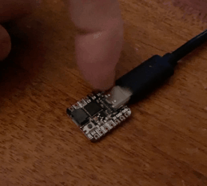

# qtpy-keys
Tiny USB keyboard using QTPy and CircuitPython

- Three touch sensors, each send a different key (LEFT_ARROW, UP_ARROW, DOWN_ARROW by default)
- R,G,B LEDs light up when a key is pressed

The QT Py has minimal flash space so copying full `adafruit_hid` library
may not work. So the included pre-built `lib` directory zipfile
contains everything needed.

Also on a Mac, copying files generates 4kB "._" meta files that fill up the
QT Py's disk space quickly.  To prevent this, you need to use the system tool
`dot_clean` on the unzipped lib directory before copying it to CIRCUITPY/lib

To install (on Mac):

```
cd ~/Downloads
git clone https://github.com/todbot/qtpy-keys
cd qtpy-keys
unzip qtpy-keys-lib.zip 
dot_clean lib
cp code.py /Volumes/CIRCUITPY
cp -r lib /Volumes/CIRCUITPY
```




